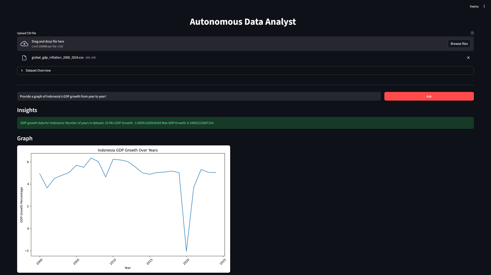

# Autonomous Data Analyst — LLM Powered Data Analysis



**Autonomous Data Analyst** is an AI-powered web application that enables users to perform exploratory data analysis using natural language. This project leverages locally hosted Large Language Models via **Ollama** to automatically generate Python code, execute it, and provide instant insights based on uploaded datasets—all while maintaining data privacy.

## 📋 Project Overview

The project pipeline automates the traditional data science workflow through four main stages:

1. **Data Ingestion & Preprocessing**: Automatically handles CSV encoding and performs intelligent date-time feature engineering.
2. **Autonomous Reasoning**: Interprets user queries (e.g., "Show me the top 5 customers by revenue") in the context of the dataset's schema.
3. **Code Generation**: Uses a locally running LLM (via Ollama) to generate precise Pandas code based on the dataset's structure and sample data.
4. **Execution & Insight**: Safely executes the generated code in a local environment and captures the output to present the final answer to the user.

## 📂 Project Structure

* **`src/`**: Core application logic.
    * `client.py`: Manages communication with the local Ollama API.
    * `executor.py`: Cleans LLM-generated markdown and executes Python code using a controlled environment.
    * `preprocessor.py`: Automates date detection and feature extraction (Year, Month, etc.).
    * `output_handler.py`: Handles output type detection, prompt formatting, and result extraction (graph, table, text).

* **`app.py`**: The Streamlit application entry point and UI layout.
* **`requirements.txt`**: List of Python dependencies required to run the project.

## 🛠️ Tech Stack

* **Python**: Core programming language.
* **Ollama (Local LLMs)**: Local Large Language Model for reasoning and code generation.
* **Streamlit**: Interactive web application framework.
* **Pandas**: For data manipulation and analysis.
* **Requests**: To handle local API calls to the Ollama server.
* **Matplotlib**: For data visualization

## 🚀 Getting Started

### 1. Prerequisites

Ensure you have **Ollama** installed and at least one supported model downloaded (e.g., Llama, Mistral, or other compatible models):

```bash
ollama pull llama3.1 

```
You may replace the model above with any other Ollama-supported model based on your preference.

### 2. Clone the Repository

```bash
git clone https://github.com/username/autonomous-data-analyst.git
cd autonomous-data-analyst

```

### 3. Install Dependencies

It is recommended to use a virtual environment.

```bash
pip install -r requirements.txt

```

### 4. Usage

Run the Streamlit application:

```bash
streamlit run app.py

```

The app will be available at: `http://localhost:8501`

## 📊 Features

* **Local & Private**: No data leaves your machine; all analysis is performed locally via Ollama-powered LLMs.
* **Intelligent Preprocessing**: Automatic detection and expansion of date columns into Year/Month features for better trend analysis.
* **Dataset Overview**: Instant statistical summaries for both numeric and categorical data upon upload.
* **Natural Language to Code**: Converts complex analytical questions into executable Pandas operations.
* **Real-time Execution**: Captures and displays code output directly in the UI for a seamless experience.

## 🤝 Contributing

Contributions are welcome! If you have suggestions for improving the prompt templates, adding data visualization support, or enhancing code execution safety, feel free to open an issue or submit a pull request.